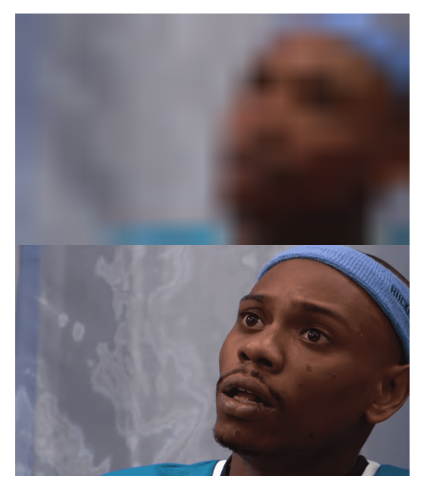

And for my next trick... I will quickly solve a bug(?) I'm seeing.

## First Bug

i do this

```mdx

```

and i get this



// show sample of the problem with this

## First fix.

I'm apparently [not the only one](https://github.com/gatsbyjs/gatsby/issues/15486) seeing this issue.

**tl;dr**  
Here's the single line of css to fix the problem.

```css
.gatsby-resp-image-background-image {
  display: none !important;
}
```

## First Hack.

Things break. They need fixed. Sometimes you have time to fix them the best way there is to fix them.

Sometimes, you just have time to fix them.

Prolific me will do well to remember this lesson.

## Publish time

I am revisiting this post a week later, planning in my head what to write. And it's done. Just missing the screenshot. So that's nice.

If I'm gonna be prolific, I should probably remember to publish.
